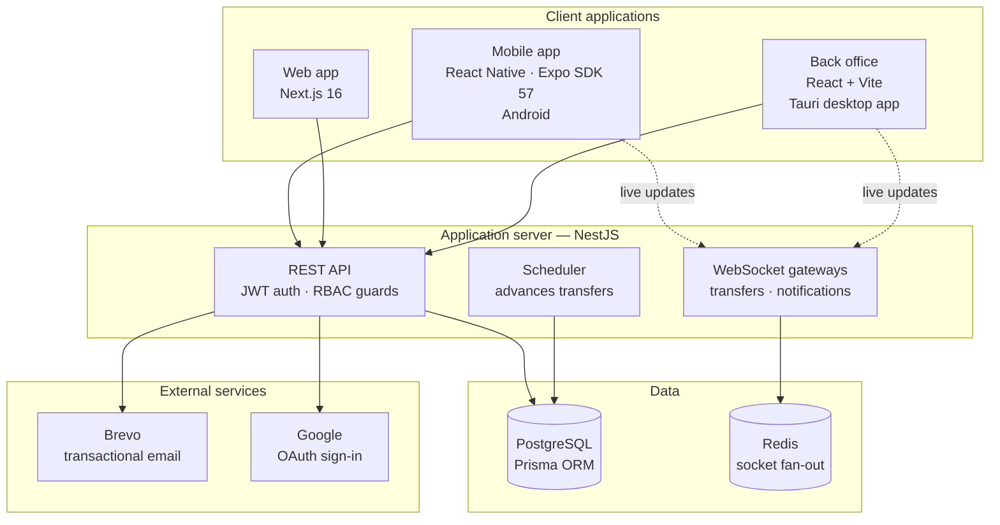
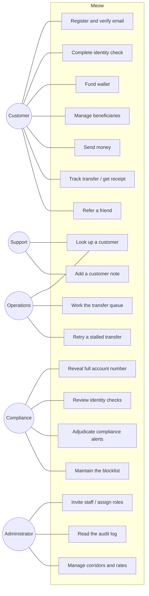
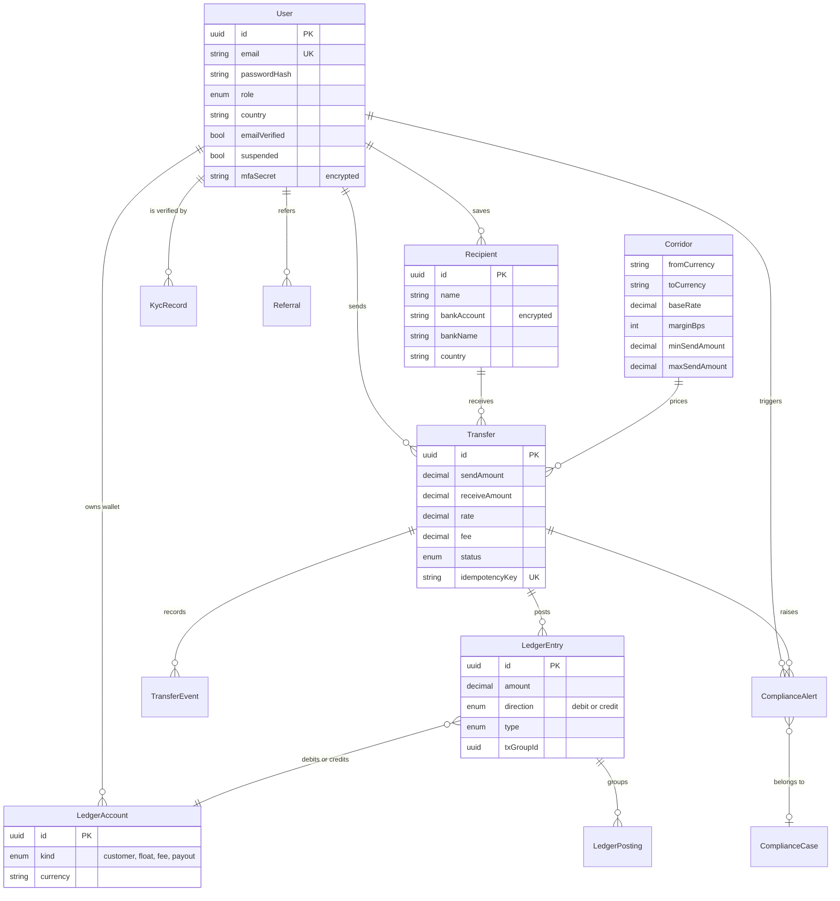
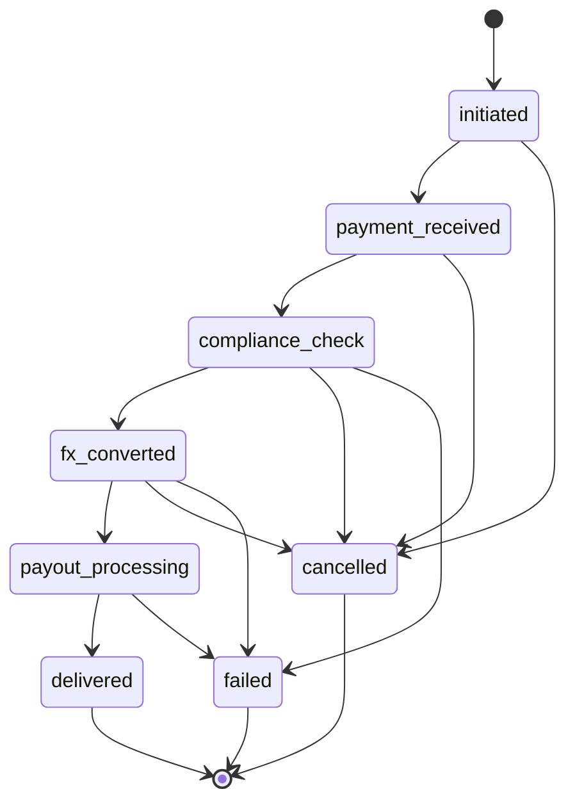

# Meow — System Overview

Remittance from Canada to Pakistan and India. This document describes what the
system does, how it is built, what it depends on, and what would be involved in
moving it to a different host.

Version 1.0.0 · Prepared 6 September 2026

---

## 1. What the product is

A customer in Canada holds a wallet, funds it, adds a beneficiary in Pakistan or
India, and sends money to them. They watch the transfer move through six stages
and receive a receipt when it lands.

Behind that sits a back office where staff run the business: an operations queue
for transfers that have stalled, an identity-verification queue, a compliance
desk for alerts and cases, a customer support view, a double-entry ledger, and
an audit log that records every staff action with a reason.

The two halves share one API. Nothing the phone app can do bypasses the rules
the back office enforces, because both talk to the same service.

### Scope of the current build

Every part of the product works end to end except the movement of real money.
Funding a wallet, converting currency and paying out are simulated, because all
three need licences and commercial agreements that are not yet in place. The
places where those services will attach are marked in the source — see
[section 9](#9-where-licensed-services-attach).

This was a deliberate order of work. The ledger, the compliance rules, the audit
trail and the state machine are the parts that are expensive to retrofit, so
they were built properly first. Connecting a payout partner changes one service;
adding a ledger afterwards would change everything.

---

## 2. System architecture



One backend serves three clients. The back office is the same web build wrapped
by Tauri, so staff install a normal Windows application rather than being told
to bookmark a URL.

Redis is not a cache here. It is the adapter that lets more than one server
instance push a live transfer update to a phone connected to a different
instance.

---

## 3. Technology

### Backend

| Component | Choice | Reason |
|---|---|---|
| Runtime | Node.js, TypeScript | One language across all four codebases |
| Framework | NestJS 11 | Module and guard structure suits per-route permission checks |
| Database | PostgreSQL | Transactions and exact decimals; money must not touch a float |
| ORM | Prisma 6 | Typed queries and a migration history |
| Validation | class-validator | Rules declared on the DTO, enforced by one global pipe |
| Auth | Passport, JWT, bcrypt | Sessions revocable server-side |
| Staff 2FA | otplib | TOTP, mandatory for every back-office account |
| Live updates | Socket.IO + Redis adapter | Survives running more than one instance |
| Email | Nodemailer via Brevo | Verification codes and transfer notices |
| Rate limiting | @nestjs/throttler | Applied to authentication routes |
| Headers | Helmet | Standard hardening |

### Clients

| Application | Stack |
|---|---|
| Mobile | React Native, Expo SDK 57, expo-router, React Native SVG, Reanimated |
| Web | Next.js 16, React, Tailwind |
| Back office | React, Vite, TanStack Query, TanStack Table, React Router, Tailwind, Tauri v2 |

### Notable implementation decisions

**Money is stored as `Decimal`, never a floating-point number.** Prisma decimals
map to Postgres `numeric`. Every calculation in `corridors.service.ts` — rate,
margin, flat fee, percentage fee — is decimal arithmetic.

**Balances are derived, not stored.** There is no balance column to fall out of
step with reality. A balance is the sum of that account's ledger postings, so it
cannot disagree with the entries that produced it.

**Bank account numbers are encrypted at rest** with AES-256-GCM
(`common/crypto/field-crypto.ts`). Staff see a masked value; revealing the full
number is a separate action that requires the `customer.pii_full` permission, a
written reason, and writes an audit entry.

**Every staff action carries a reason.** The audit writer will not record an
action without one. This is enforced by the type, not by convention.

---

## 4. Use cases



Roles are not decorative. There are 30 named permissions in
`backend/src/auth/permissions.ts` mapped to five roles, and each API route
declares the one it needs. The back office builds its navigation from the
permission list returned at sign-in, so a support user is never shown a page
they would be refused.

---

## 5. Data model

The main entities and their relationships. Supporting tables — sessions,
notifications, audit log, approval requests — are omitted for readability.



### The ledger

Every movement of value writes two entries that sum to zero, sharing a
`txGroupId`. A transfer of 100 CAD with a 2 CAD fee produces a debit of 102
against the customer's wallet, a credit of 100 to the payout account and a
credit of 2 to the fee account. Nothing is ever updated or deleted; a correction
is a new pair of entries.

This is why the back office can show both legs of any transfer, and why a
balance never needs reconciling against a stored figure.

---

## 6. Sending money — sequence

```mermaid
sequenceDiagram
    actor U as Customer
    participant App as Mobile app
    participant API as API
    participant Scr as Screening
    participant L as Ledger
    participant DB as PostgreSQL
    participant WS as Socket gateway

    U->>App: enters amount and beneficiary
    App->>API: GET /corridors/quote
    API-->>App: rate, fee, amount received

    U->>App: confirms
    App->>API: POST /transfers (idempotencyKey)

    API->>DB: existing transfer for this key?
    alt key already used
        DB-->>API: existing transfer
        API-->>App: that transfer (no second debit)
    else new
        API->>Scr: blocklist check
        Scr-->>API: clear
        API->>L: debit wallet, credit payout and fee
        L->>DB: two balanced entries, one txGroupId
        API->>DB: transfer created, status = initiated
        API-->>App: transfer
    end

    App->>WS: subscribe to this transfer

    loop each stage
        Note over API,DB: today a scheduler advances the status;<br/>under a licence the payout partner's webhook does
        API->>DB: status advances (compare-and-set)
        API->>WS: emit update
        WS-->>App: live status
    end

    API->>U: notification and receipt on delivery
```

Two details carry most of the safety here. The **idempotency key** is generated
once when the review screen opens, not when the button is pressed, so a customer
who taps twice or retries after a timeout gets the same transfer rather than a
second one. And the ledger write and the transfer row are committed in the same
database transaction, so a transfer can never exist without its money movement.

---

## 7. Transfer states



A customer may cancel for a full refund up to the point the money reaches the
payout stage. After that it is out of our hands.

Transitions use a compare-and-set on the current status. If two processes try to
advance the same transfer, one write lands and the other finds the status
already changed and stops. That property is what will make a payout partner's
webhook safe to receive more than once, which every partner eventually does.

---

## 8. External services

| Service | What it does | Where it is configured | If it went away |
|---|---|---|---|
| **Railway** | Hosts the API, PostgreSQL and Redis | Railway dashboard; `DATABASE_URL`, `REDIS_URL` | Replaceable — see section 10 |
| **Brevo** | Sends verification codes and transfer notices | `SMTP_*`, `MAIL_FROM` | Any SMTP provider; one env change |
| **Google** | Optional "Sign in with Google" | `GOOGLE_CLIENT_ID`, `GOOGLE_CLIENT_SECRET` | Email and password still work |
| **Expo / EAS** | Builds the Android app, distributes updates | `mobile/eas.json` | Can build locally with Android Studio |
| **GitHub** | Source control | — | Any Git host |

Nothing above is embedded in the application logic. Each is reached through a
single module (`mail/`, `auth/`, `prisma/`), which is what makes them
interchangeable.

There is no payment processor, no FX feed and no payout partner in this list,
because none has been engaged yet.

---

## 9. Where licensed services attach

Five points in the code are where regulated third parties will connect once the
licences are granted. Each is commented in place. To find them all:

```bash
grep -rn "LICENSED-INTEGRATION" backend/src
```

| Seam | File | What replaces the current behaviour |
|---|---|---|
| Payment acquiring | `wallet/wallet.service.ts` | Card or bank debit through an acquirer; the wallet is credited only on the settlement webhook, never in the request that starts the payment |
| Payout partner | `transfers/transfers.scheduler.ts` | An outbound payout instruction and a signed webhook when the partner settles; the scheduler becomes the reaper for transfers nobody called back about |
| Identity verification | `compliance/compliance.service.ts` | A document-and-selfie check with a provider such as Onfido or Sumsub, decided asynchronously |
| Sanctions and PEP screening | `screening/screening.service.ts` | Matching against OFAC, UN and Canadian lists plus PEP data, feeding the same alert queue |
| Live FX rates | `corridors/corridors.service.ts` | A rate feed, with quotes stored and honoured for a stated window |

The comments explain what changes and, more usefully, what does not. In most
cases the surrounding structure is already the shape the licensed version needs:
`KycRecord` already stores a provider name and reference, alerts already have an
adjudication queue, and transfer transitions are already idempotent.

---

## 10. Moving to a different host

Railway runs three things: the Node application, a PostgreSQL database and a
Redis instance. None of them is Railway-specific. The application reads a port
from `PORT` and connection strings from `DATABASE_URL` and `REDIS_URL`, which is
the same contract every other platform offers.

There is no Railway SDK in the dependency list, no Railway-specific
configuration file in the repository, and no code that behaves differently
because it is running there. The lock-in is operational rather than technical.

### What a migration involves

**1. Somewhere to run the application.** Options, roughly in order of effort:

| Target | Notes |
|---|---|
| Render, Fly.io, Heroku | Closest to Railway. Connect the repository, set environment variables, done |
| AWS App Runner, Azure Container Apps, Google Cloud Run | Container-based. The repository already has a `docker-compose.yml` to work from |
| A virtual machine | Most control, most upkeep. Node 20+, a process manager, and a reverse proxy for TLS |

**2. A PostgreSQL database.** Any managed Postgres works — RDS, Cloud SQL, Neon,
Supabase, DigitalOcean. Move the data with the standard tools:

```bash
pg_dump "$OLD_DATABASE_URL" --no-owner --no-privileges -Fc -f meow.dump
pg_restore -d "$NEW_DATABASE_URL" --no-owner --no-privileges meow.dump
```

Then confirm the schema history matches:

```bash
cd backend && npx prisma migrate status
```

**3. A Redis instance.** Only used for socket fan-out between instances, so it
holds nothing that needs migrating. Point `REDIS_URL` at the new one. If the new
platform runs a single instance, Redis can be omitted entirely.

**4. Environment variables.** Copy them across. The ones that must be carried
over rather than regenerated are `ENCRYPTION_KEY` and `JWT_SECRET`.
`ENCRYPTION_KEY` especially: encrypted bank account numbers cannot be read
without the key that wrote them. Regenerating it makes existing beneficiary
records permanently unreadable.

**5. Repoint the clients.** One value each:

- Mobile — `EXPO_PUBLIC_API_URL` in `mobile/eas.json`, then a new build
- Back office — the API base URL in `admin/src/lib/api.ts`, and the
  `connect-src` entry in the Tauri content-security policy in
  `admin/src-tauri/tauri.conf.json`
- Web — `NEXT_PUBLIC_API_URL`

**6. Update `CORS_ORIGINS`** on the server to the new client origins.

### Suggested order

Run both environments at once. Restore a dump to the new database, deploy the
application there, and exercise it with a test account before changing a single
DNS record or client build. The only irreversible step is the cutover of writes,
so leave it until last and take a final dump immediately before it.

Expect the whole exercise to take a working day, most of it waiting for a
database restore and a mobile build.

---

## 11. Security posture

- Passwords hashed with bcrypt. Sessions are database-backed and can be revoked;
  changing a password revokes all of them.
- Two-factor authentication is mandatory for every back-office account. A staff
  member who has not enrolled can reach the enrolment endpoints and nothing
  else.
- Thirty named permissions across five roles, checked by a guard on every admin
  route. The role is re-read from the database on each request, so a change
  takes effect immediately without forcing anyone to sign in again.
- Bank account numbers encrypted with AES-256-GCM. Revealing one requires a
  specific permission, a reason, and leaves an audit entry naming the record.
- Every staff write is audited with actor, reason, before and after values.
- Administrator accounts are created by a one-time bootstrap command, not by an
  environment variable consulted at every login.
- Input is validated on the server by declared rules; the clients mirror the
  same limits so a field stops accepting characters the server would reject.
  The server remains the enforcement point.

---

## 12. Repository layout

```
backend/    NestJS API, Prisma schema, migrations, tests
mobile/     React Native (Expo) Android app
admin/      React + Vite back office, wrapped by Tauri
web/        Next.js customer site
design/     Brand assets and the icon build script
docs/       This document, release and setup notes
scripts/    Repository-level helpers
```

Test coverage sits at 279 tests across 27 suites, covering the ledger, the
permission model, transfer idempotency, screening rules and the staff lifecycle.

```bash
cd backend && npm test
```
